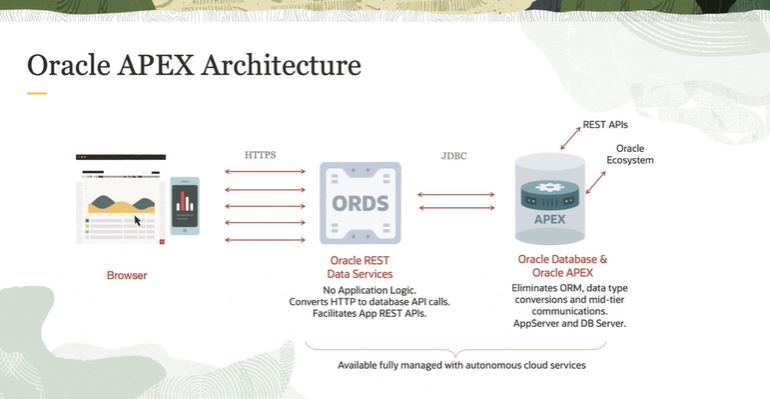

# Oracle Application Express

APEX is Oracle's stategic low code application development platform to build modern, beautiful, and responsive web applications.

APEX lets you build enterprise apps **20x faster** with **100x less code**.

APEX is fully supported, *no-cost feature* of Oracle Database. 

APEX can quickly build: 
- reposts
- forms
- charts
- calendars
- etc.

APEX enables organizations to capitalize on their existing investments in SQL and PL/SQL skills.

With APEX, the application development environment is in a web browser, no client software needed.

## APEX distinguished characteristics

- the IDE is the web browser (no client software needed)
- app definitions are stored in the database as metadata
- declarative application development (no code generation)
- data processing is made in the database

## APEX architecture

Oracle APEX uses a simple three-tier architecture:

1. client (browser)
2. web server (Oracle REST Data Services)
3. database (Oracle Database & Orace APEX)

All processing, data manipulation and business logic is executed within the database.

This architecture garantees zero latency data access, top performance and scalability out of-the-box.

Oracle APEX can be deployed wherever Oracle Database Runs (Oracle Cloud, Dedicated Region, Third Party, On-Premises).
