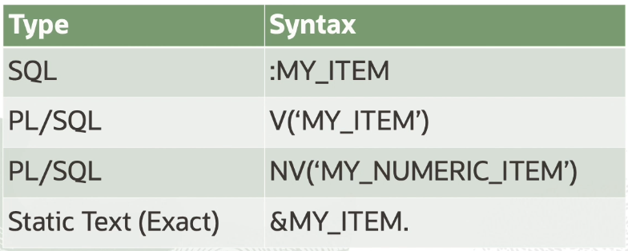

# APEX Page Controls

Developers can create and manage a variety of application page controls. 

There are two types of items:
- page level items
- application level items

## Page Level Items

Page Items are placed on a page and have associated user interface properties, such as display only, label and label template.

Examples of page level items include:
- text field
- text area
- password
- select list
- checkbox
- etc.

You can reference item values stored in a session state and regions, computations, validation, processes, and branches. The syntax for referring item values are shown in the table below.

## Application Level Items

Application Items are not associated with the page and therefore, have no user interface properties. You can use an application item as a global variable. 

Application items can be set using computations, processes, or bypassing values on a URL. You use application items to maintain a session state that is not displayed and is not specific to any page.
