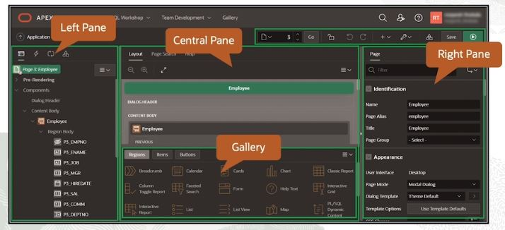

# Page Designer

Page Designer sections:
 - toolbar (displayed at the top of the page)
	- page selector
	- messages (errors and warnings)
	- page locker
	- undo changes
	- redo changes
	- create menu
	- utilities menu
	- shared components
	- save button
	- run button
- left pane (tabs)
	- rendering 
		- pre-rendering
		- components
		- post-rendering
	- dynamic actions
		- events (page load, change, click, etc.)
	- processing
		- after submit
		- validating
		- processing
	- page shared components
		- navigation menu
		- navigation bar
		- etc.
- central page
	- layout
	- page search
	- help
- gallery
	- regions
	- items
	- buttons
- right pane
	

